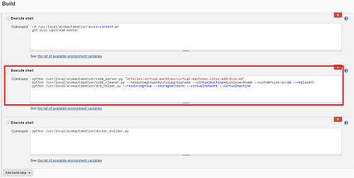

## Installing the environment
The bulk of the install and configure is handled through the use of an Azure Resource Manager (ARM) template and custom script extension (but of course!).

The ARM template will create an Ubuntu 16.04-LTS VM, then the custom script will install the latest Jenkins and Docker stable builds. A configuration script for git will also be copied over to the VM, but you'll need to SSH to the VM in order to provide your GitHub username and access token in order to clone and pull down the ACOM repository. See [the configuration steps below](#configuring-git-and-jenkins authentication).

Deploy the ARM template through the portal:

<a href="https://portal.azure.com/#create/Microsoft.Template/uri/https%3A%2F%2Fraw.githubusercontent.com%2Fiainfoulds%2Facom-automation%2Fmaster%2armtemplate%2Fazuredeploy.json" target="_blank">
    
</a>

Via the Azure CLI:

```bash
azure group create ACOMAutomation --location westus
azure group deployment create --resource-group ACOMAutomation --template-uri https://raw.githubusercontent.com/iainfoulds/acom-automation/master/armtemplate/azuredeploy.json
```

Via Azure PowerShell:


## Configuring Git and Jenkins authentication

1. Use an SSH client (such as Putty for Windows users) to SSH to the DNS name you specified during deployment
2. Edit the `configure_git.sh` script:

    ```bash
    sudo nano /usr/local/acomautomation/configure_git.sh
    ```

    You need to enter your GitHub username and access tokens in the same way was when you clone a repo on your local machine. The script is just automating the process and configuring some file permissions afterwards:

    ```bash
    git clone https://[your GitHub user name]:[token]@github.com/[your GitHub user name]/azure-content-pr.git
    git remote add upstream https://[your GitHub user name]:[token]@github.com/Azure/azure-content-pr.git
    ```

3. Now run the script to configure git and the appropriate permissions for Jenkins to use:

    ```bash
    sudo /usr/local/acomautomation/configure_git.sh
    ```

4. The Jenkins web interface is secured by default (and Network Security Group rules are created for you to make it publicly accessible), so you need to obtain the admin password in order to log in. If you think this is an overly complex way of doing it, this is a Jenkins thing and not because of the deployment model in use here:

    ```bash
    sudo cat /var/lib/jenkins/secrets/initialAdminPassword
    ```

    - Open a web browser and go to http://yourdomain:8080
    - Enter `admin` for the username and then enter the value from the `initialAdminPassword` file for `Password`.
    - Click the `admin` username in the top right-hand corner of the Jenkins portal once logged and click `Configure`.
    - Change the password to something a little more memorable...


## Configuring Jenkins jobs

In Jenkins, projects are used to define each task that you would like to run. A sample project, `sample-acom-job`, will have been created that contains the outline for your own projects. Best practice would be to simply copy this default sample acom job each time you want to create your own job.

To create your own project from the ACOM sample:

- Click 'New item' in the top left-hand corner. A recommendation would be to name it the same as the article you will be processing.
- Give your project a name, then in the `Copy from` box, start typing in `sample` and select the `sample-acom-job` project.
- Once the new project opens, feel free to edit the `Description` to match what your task will doing

The existing ACOM sample project showcases how the actual app works. In Jenkins, the actual work is carried out by `Build` activites. Scroll down in either the sample project or your new project copied from the sample to see the build steps. The primary work is carried out in the middle execution shell:



Let's look at the actual steps:

```bash
python /usr/local/acomautomation/code_parser.py "articles/virtual-machines/virtual-machines-linux-add-disk.md"
python /usr/local/acomautomation/code_cleaner.py --resourcegroup=myuniquegroupname --virtualmachine=myuniquevmname --custom=size-in-GB --replace=5
python /usr/local/acomautomation/arm_helper.py --resourcegroup --storageaccount --virtualnetwork --virtualmachine
```

### Code parsing
The first line calls a Python script to parse a given MD file and find any code that is executing Azure CLI commands. You need to pass in the path to whatever doc you want to have parsed, relative to the root directory of the ACOM repo:

```bash
python /usr/local/acomautomation/code_parser.py "articles/virtual-machines/virtual-machines-linux-add-disk.md"
```

### Code cleaning
In order to actually make sure that the scripts can execute Azure CLI commands within your doc, you need to tell the app what values you used to prompt users to enter their own resource group name, VM name, etc. The sample project uses the example to [Add a disk to a Linux VM](https://azure.microsoft.com/documentation/articles/virtual-machines-linux-add-disk/). In that doc, the following code example was provided:

```bash
azure vm disk attach-new <myuniquegroupname> <myuniquevmname> <size-in-GB>
```

Here, `myuniquegroupname` was used to prompt for the resource group name and `myuniquevm` was used to prompt for the VM name. The code cleaner script accepts `--resourcegroup=` and `--virtualmachine=` as parameters in order for you to tell the app what it needs to replace for you. Don't worry about any surrounding characters, in this example `<>`, or anything you may use such as `**`, `[]`, or `_ _`. The code cleaner automatically removes these.

In order to handle things beyond the resource group name or VM name, you can specify `--custom` and `--replace` for an additional variable you have used. This helps in our sample doc where we need to provide the size of the disk we want to create. We can use `--custom=size-in-GB` to tell the app we have a custom parameter to look for, and replace those instances by using `--replace=5` to create a 5GB disk.

Back in our Jenkins build step, the parameters passed to the code cleaner should now make sense:

```bash
python /usr/local/acomautomation/code_cleaner.py --resourcegroup=myuniquegroupname --virtualmachine=myuniquevmname --custom=size-in-GB --replace=5
```

### Create supporting resources
Our docs often go straight in to the examples of how to create or configure a specific feature. The example code samples don't always create the pre-requisite resources needed. In our disk example, the code simply shows what is needed to add a disk to a VM, but how can the app test this without actually having a VM to begin with? The ARM helper script will create some core Azure resources for you:

- To create a resource group, specify `--resourcegroup`
- To create a storage account, specify `--storageaccount`
- To create a virtual network and subnet, specify `--virtualnetwork`
- To create a VM, specify `--virtualmachine`

All of the default names for these resources are defined in the `acom_config.py` file should you wish to change them. These resources are all removed after each build, so if you have Jenkins executing this on a schedule during the night, you won't even see these resources when you look in the Azure portal.

In our example, we want to create all of the core resources, so we specify the following:

```bash
python /usr/local/acomautomation/arm_helper.py --resourcegroup --storageaccount --virtualnetwork --virtualmachine
```